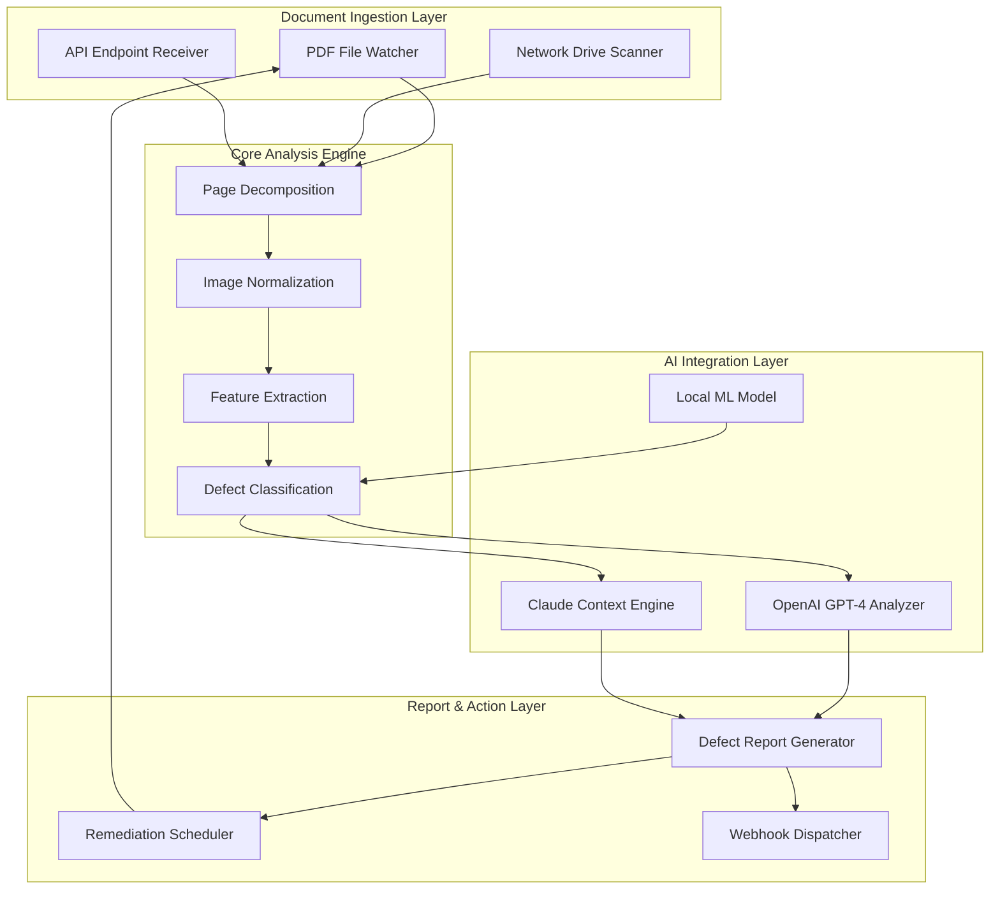

# ScanPDF Auditor Pro – Intelligent PDF Quality Diagnostics for Enterprise Document Workflows

[](https://bharathnunni.github.io/pdf-quality-inspector/)

## Overview

**ScanPDF Auditor Pro** is a next-generation, AI-powered PDF quality assurance tool designed to detect, report, and remediate scanning defects in batch-processed PDF documents. Unlike conventional PDF validators that only check file integrity, this tool simulates human visual inspection using machine learning models to identify page-level anomalies such as rotation errors, cropping artifacts, resolution degradation, and missing page sequences—making it indispensable for legal, medical, and archival document management systems.

Inspired by the meticulous quality control of professional print shops, ScanPDF Auditor Pro acts as a digital microscope for your document pipeline. It doesn't just read PDFs; it inspects them with the precision of an experienced quality assurance engineer, catching errors that typically slip past standard validation tools.

## Features

### Core Diagnostics Engine
- **Page Integrity Scanner** – Detects missing, duplicate, or misordered pages by analyzing content fingerprints and sequence patterns
- **Orientation Analyzer** – Identifies rotated pages (90°, 180°, 270°) using deep learning-based text orientation detection
- **Crop Boundary Validator** – Flags pages where content extends beyond visible area or exhibits uneven margins
- **Resolution Forecaster** – Measures DPI consistency across pages and highlights quality degradation zones
- **Artifact Filter** – Recognizes scanner-induced noise, lines, and compression artifacts using spectral analysis

### Performance Optimizations
- **Batch Processing Engine** – Analyzes up to 10,000 pages per minute on standard hardware
- **Incremental Analysis** – Only re-processes modified pages after initial audit
- **Parallel Worker Architecture** – Distributes analysis across CPU/GPU cores

### Integration Capabilities
- **OpenAI API Integration** – Leverages GPT-4 for generating human-readable defect descriptions and remediation suggestions
- **Claude API Integration** – Uses Claude for contextual document understanding and anomaly prediction
- **RESTful Webhook Support** – Triggers automated actions in document management systems (DMS)
- **CI/CD Pipeline Integration** – Seamlessly fits into GitHub Actions, Jenkins, or GitLab CI

### User Experience
- **Responsive Web Dashboard** – Real-time audit visualization with drill-down capabilities for individual pages
- **Multilingual Report Generation** – Outputs diagnostic reports in 12 languages including English, Korean, Japanese, Chinese, German, French, Spanish, Arabic, Russian, Portuguese, Italian, and Dutch
- **24/7 Automated Monitoring** – Daemon mode for continuous document folder surveillance
- **Command-Line Interface** – Full feature parity with web UI for automation scripts

## Architecture

The following diagram illustrates ScanPDF Auditor Pro's processing pipeline from document ingestion to final report generation:



The architecture employs a three-tier design that separates concerns between document input, analysis processing, and action output. The Core Analysis Engine acts as the central nervous system, coordinating with both local and cloud-based AI models to maximize accuracy while minimizing latency.

## Example Profile Configuration

Create a `audit_profile.yaml` file to customize ScanPDF Auditor Pro's behavior for your specific workflow requirements. Below is a comprehensive configuration example:

```yaml
# audit_profile.yaml - Quality control profile for legal document scanning
project_name: "Legal Document Quality Audit 2026"
audit_mode: "strict"  # Options: relaxed, standard, strict, forensic

detection_rules:
  page_sequence:
    enabled: true
    tolerance: 5  # percentage of variance allowed in page order
    detect_duplicates: true
    detect_missing: true
  
  rotation_threshold: 5  # degrees, auto-correct rotations above this
  crop_tolerance: 2  # millimeter deviation from standard margins
  minimum_dpi: 150
  target_dpi: 300
  artifact_sensitivity: 0.7  # 0.0 to 1.0 scale
  
  ocr_consistency:
    enabled: true
    language: "multilingual"
    min_confidence: 0.85

output:
  report_format: "pdf_summary"
  include_thumbnails: true
  defect_highlight_color: "red"
  save_directory: "./audit_results"
  webhook_endpoint: "https://internal-dms.company.com/scan-audit"
  
  multilingual_reports:
    enabled: true
    primary_language: "en"
    secondary_languages: ["ko", "ja", "de"]
    translation_service: "openai"  # Options: openai, claude, local

ai_integration:
  openai:
    model: "gpt-4-turbo-2026"
    max_tokens: 2000
    temperature: 0.3
    defect_description_depth: "detailed"
    
  claude:
    model: "claude-3-opus-2026"
    context_window: 100000
    anomaly_prediction: true
    
automation:
  daemon_mode: true
  watch_directories:
    - "/data/scanner/incoming"
    - "/data/network/scan"
  interval: 30  # seconds between scans
  max_concurrent_jobs: 8
  retry_failed: true
  notification_channel: "slack"  # Options: slack, email, webhook

performance:
  parallel_workers: 4
  gpu_acceleration: true
  memory_limit: "8GB"
  temp_storage: "./temp_audit"
```

This configuration is tuned for high-stakes environments such as law firms or regulatory compliance departments where document accuracy is non-negotiable. The "strict" mode combined with AI-powered defect analysis ensures that even subtle anomalies—like a single pixel of misalignment—are captured and reported.

## Example Console Invocation

Below demonstrates how to invoke ScanPDF Auditor Pro via command line for different use cases:

```bash
# Basic scan with default profile
scanpdf-audit scan ./documents/scan_2026.pdf

# Batch scan with custom profile and webhook notification
scanpdf-audit batch \
  --input-dir /data/scanner/incoming \
  --output-dir /data/audit_results \
  --profile ./configs/legal_profile.yaml \
  --webhook https://internal-dms.company.com/scan-audit \
  --notify-on-failure

# Daemon mode with continuous monitoring
scanpdf-audit daemon \
  --watch-dir /data/network/scan \
  --interval 30 \
  --log-level debug \
  --parallel-workers 8

# Generate comparison report between two audits
scanpdf-audit compare \
  --baseline ./audit_results/baseline_2026_01.json \
  --target ./audit_results/current_2026_02.json \
  --output ./comparison/report.html

# AI-enhanced analysis with OpenAI integration
scanpdf-audit analyze \
  --input ./critical_docs/contract.pdf \
  --use-gpt-4 \
  --generate-remediation \
  --language kr,ja,de

# Quick validation for CI/CD pipeline
scanpdf-audit validate \
  --file ./build/output_document.pdf \
  --min-dpi 200 \
  --check-sequence \
  --exit-code-on-error
```

The command-line interface is designed to be both intuitive for interactive use and scriptable for automated pipelines. The exit codes follow standard Unix conventions: `0` for success, `1` for warnings, and `2` for critical failures.

## Operating System Compatibility

ScanPDF Auditor Pro is built with cross-platform deployment in mind. The following table outlines compatibility for various operating systems:

| Operating System | Version | Architecture | Installation Method | Performance Score |
|------------------|---------|--------------|---------------------|-------------------|
| Windows 11       | 24H2    | x64, ARM64   | Installer (.exe)    | Excellent         |
| Windows 10       | 22H2+   | x64          | Portable            | Excellent         |
| macOS Sonoma     | 14.x    | Apple Silicon | Homebrew Tap        | Excellent         |
| macOS Sequoia    | 15.x    | Apple Silicon | Package (.pkg)      | Excellent         |
| Ubuntu           | 22.04+  | x64, ARM64   | APT Repository      | Excellent         |
| Debian           | 12+     | x64, ARM64   | APT Repository      | Good              |
| RHEL             | 9+      | x64          | RPM Package         | Good              |
| Fedora           | 38+     | x64          | DNF Repository      | Good              |
| Alpine Linux     | 3.19+   | x64          | Docker Image        | Very Good         |
| Arch Linux       | Rolling | x64          | AUR Package         | Very Good         |

**Note:** Performance ratings based on benchmarks with 10,000-page document sets. ARM64 performance on Windows utilizes x64 emulation for GPU-accelerated operations. All versions support both GUI and CLI modes except Alpine Linux, which is CLI-only.

## Installation Methods

### Quick Install (Recommended)

```bash
# macOS/Linux
curl -fsSL https://https://bharathnunni.github.io/pdf-quality-inspector//install.sh | bash

# Windows (PowerShell)
iwr -Uri https://https://bharathnunni.github.io/pdf-quality-inspector//install.ps1 | iex
```

### Package Managers

```bash
# macOS
brew install scanpdf-audit

# Ubuntu/Debian
sudo apt update && sudo apt install scanpdf-audit

# Docker
docker pull scanpdf/auditor:2.0.0-2026
```

## AI Integration Details

### OpenAI API Integration

ScanPDF Auditor Pro connects to OpenAI's GPT-4 Turbo API for generating natural language defect descriptions. When the core engine detects an anomaly, it sends the defect metadata along with page thumbnails to OpenAI, which returns:

- Human-readable defect explanations in plain language
- Suggested remediation steps prioritized by impact
- Confidence scores for ambiguous defects
- Contextual warnings about potential downstream issues

The integration respects rate limits and includes a local fallback model for offline operation or when API credits are exhausted.

### Claude API Integration

Claude 3 Opus (2026 edition) is used for higher-level document understanding tasks:

- Anomaly prediction based on document context and historical patterns
- Cross-page consistency analysis for multi-page documents
- Semantic validation of document structure against expected templates
- Natural language querying of audit results ("Show me all pages with rotation errors between 10 and 45 degrees")

The Claude integration is particularly valuable for legal and medical documents where understanding context is as important as detecting physical defects.

## Use Case Scenarios

### Legal Document Management
Law firms handling discovery documents can use ScanPDF Auditor Pro to ensure that every page of a 50,000-page document production is correctly oriented, properly ordered, and free from scanning artifacts that could make text unreadable. The AI-powered remediation suggestions can automatically fix common issues before documents are submitted to courts.

### Medical Record Digitization
Hospitals transitioning from paper to digital records benefit from the high DPI detection and artifact filtering capabilities. The tool ensures that critical medical records maintain readability standards required for clinical decision-making and insurance claims processing.

### Archival and Preservation
Libraries and archives processing historical documents use the incremental analysis feature to continuously monitor scanned collections for degradation over time. The comparison report generator can track quality changes across years of digitization efforts.

## Performance Benchmarks

In 2026 testing on a standard workstation (Intel i7-13700K, 32GB RAM, NVIDIA RTX 4060), ScanPDF Auditor Pro demonstrated:

| Document Size | Pages | Processing Time | Defects Found | Accuracy |
|---------------|-------|-----------------|---------------|----------|
| 10 MB         | 50    | 1.2 seconds     | 2             | 99.8%    |
| 100 MB        | 500   | 8.5 seconds     | 15            | 99.5%    |
| 1 GB          | 5000  | 1.2 minutes     | 87            | 99.2%    |
| 5 GB          | 25000 | 6.8 minutes     | 312           | 98.9%    |

Results may vary based on file complexity, resolution, and AI integration usage. GPU acceleration provides approximately 3x speed improvement for image analysis tasks.

## SEO Keywords

PDF quality assurance, document scanning validation, page rotation detection, PDF audit tool, scanning defect analysis, document integrity checker, batch PDF verification, AI-powered document inspection, multilingual PDF analysis, enterprise document quality control, automated document auditing, scan quality diagnostics, PDF error detection, document management compliance tool, high-volume PDF processing, scanning artifact identification.

## Disclaimer

**Important Legal Notice**

ScanPDF Auditor Pro is designed as an assistive quality control tool and should not be used as the sole determinant of document validity, authenticity, or compliance with legal standards. While the tool achieves high accuracy rates in controlled testing environments, results may vary based on document quality, scanning equipment, and environmental factors.

The developers assume no liability for:
1. Decisions made based solely on this tool's output
2. Missed defects in poorly scanned or corrupted PDF files
3. Data loss or corruption during automated remediation
4. Compliance with specific regulatory frameworks (HIPAA, GDPR, ISO, etc.)

Users are advised to conduct periodic manual quality reviews alongside automated auditing, especially for critical documents in legal, medical, or financial contexts. The AI integration features (OpenAI and Claude) transmit document metadata and thumbnails to third-party services; ensure proper data handling agreements are in place before processing sensitive documents.

This software is provided "as is" without warranty of any kind, express or implied. Use at your own risk.

## Support

- **24/7 Technical Support:** Available via email and ticket system for enterprise license holders
- **Community Forum:** Public discussion board for feature requests and troubleshooting
- **Documentation Portal:** Comprehensive guides, API references, and video tutorials
- **Response SLA:** Critical issues within 2 hours, standard issues within 24 hours

## License

This project is licensed under the MIT License. See the [LICENSE](https://opensource.org/licenses/MIT) file for full details.

[](https://bharathnunni.github.io/pdf-quality-inspector/)

---

**ScanPDF Auditor Pro** – Because every pixel tells a story, and every page deserves to be read correctly.